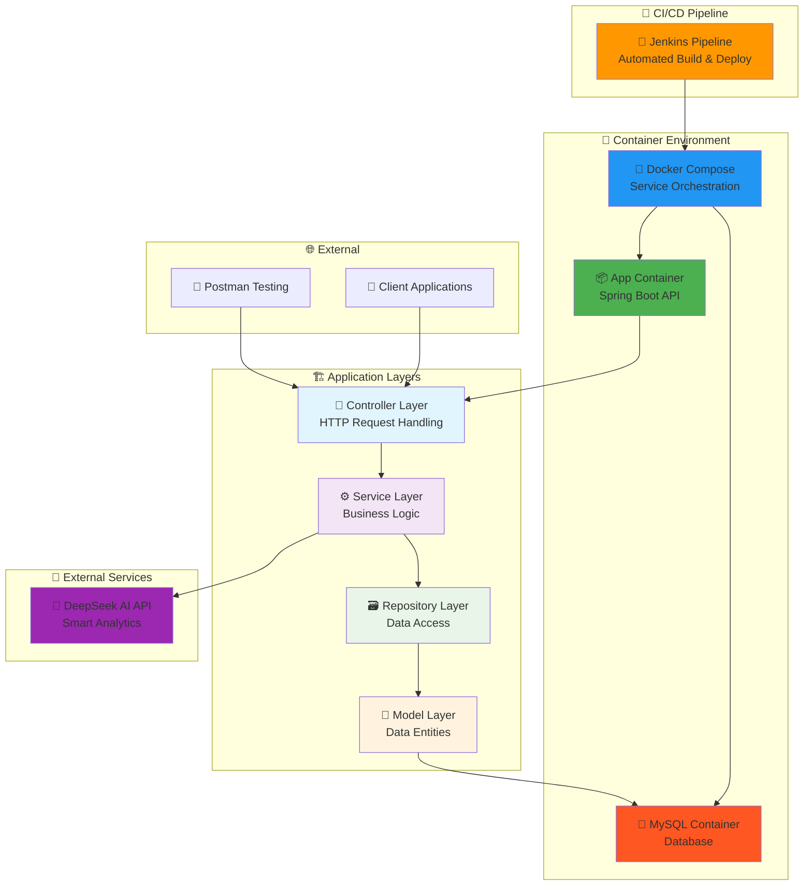
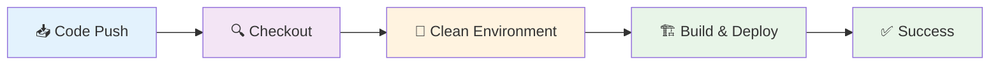
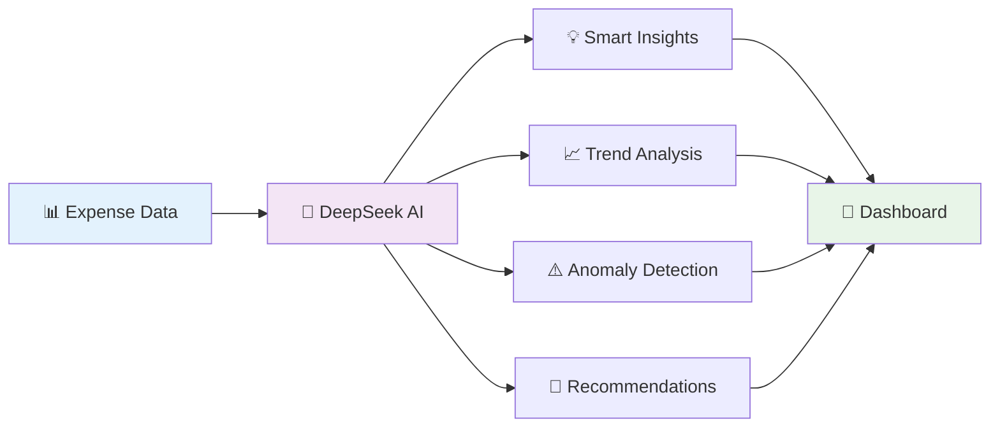

# 💸 Expense Tracker API

<div align="center">


**🚀 A production-ready Expense Tracker REST API with AI integration, containerized deployment, and CI/CD pipeline**

*✅ CRUD endpoints • 💾 Data persistence • 🤖 AI insights • 🐳 Docker deployment • 🔄 Jenkins CI/CD*

[📖 Documentation](#-api-endpoints) • [🚀 Quick Start](#-quick-start) • [🐳 Docker Setup](#-docker-deployment) • [🔄 CI/CD](#-cicd-pipeline)

</div>

---

## 🌟 Features

<div align="center">

| 🎯 **Core Features** | 🔮 **Advanced Features** | 🚀 **DevOps Features** | 🤖 **AI Features** |
|:---:|:---:|:---:|:---:|
| ✅ Full CRUD Operations | 📊 Expense Analytics | 🐳 Docker Containerization | 🧠 DeepSeek AI Integration |
| 💾 MySQL Integration | 📈 Total Calculations | 🔄 Jenkins CI/CD Pipeline | 💡 Smart Insights |
| 🌐 RESTful API Design | 🧪 Unit Testing | 🏗️ Multi-stage Builds | 📊 Spending Analysis |
| 📦 Spring Boot Framework | 📋 Data Validation | 🔍 Health Checks | ⚠️ Anomaly Detection |

</div>

---

## 📁 Project Architecture



---

## 🚀 Quick Start

### 🔧 Prerequisites

```bash
☕ Java 17 or higher
🌱 Spring Boot 2.7.3+
🐳 Docker & Docker Compose
🔨 Jenkins (for CI/CD)
🧪 Postman (for testing)
```

### 📦 Installation Options

#### Option 1: 🐳 Docker Deployment (Recommended)

1. **Clone the repository**
   ```bash
   git clone https://github.com/yourusername/expense-tracker-api.git
   cd expense-tracker-api
   ```

2. **Configure environment variables**
   ```bash
   # Create .env file
   cp .env.example .env
   
   # Edit with your values
   MYSQL_ROOT_PASSWORD=your_root_password
   MYSQL_DATABASE=expenseDB
   SPRING_DATASOURCE_USERNAME=your_db_user
   SPRING_DATASOURCE_PASSWORD=your_db_password
   DEEPSEEK_API_KEY=your_deepseek_api_key
   DEEPSEEK_API_URL=https://api.deepseek.com/v1
   ```

3. **Start the application**
   ```bash
   docker-compose up --build -d
   ```

4. **Verify deployment**
   ```bash
   curl http://localhost:8080/api/expenses
   ```

#### Option 2: 🛠️ Manual Setup

1. **Clone and configure database**
   ```properties
   # application.properties
   spring.datasource.url=jdbc:mysql://localhost:3306/expense_tracker
   spring.datasource.username=your_username
   spring.datasource.password=your_password
   spring.jpa.hibernate.ddl-auto=update
   ```

2. **Run the application**
   ```bash
   ./mvnw spring-boot:run
   ```

---

## 🐳 Docker Deployment

### 🏗️ **Container Architecture**

Our Docker setup includes:
- **🐬 MySQL 8.0** - Database container with persistent volumes
- **☕ Spring Boot App** - Containerized API with health checks
- **🌐 Bridge Network** - Secure inter-container communication
- **💾 Volume Persistence** - Data survival across container restarts

### 📋 **Docker Services**

| Service | Container | Port | Health Check | Purpose |
|:--------|:----------|:-----|:-------------|:--------|
| `mysql-db` | expense-tracker-mysql | 3307:3306 | ✅ mysqladmin ping | Database |
| `expense-tracker-api` | expense-tracker-app | 8080:8080 | 🔄 Depends on MySQL | API Server |

### 🚀 **Quick Commands**

```bash
# Start all services
docker-compose up -d

# View logs
docker-compose logs -f

# Stop services
docker-compose down

# Rebuild and restart
docker-compose up --build -d

# Clean everything (⚠️ removes data)
docker-compose down -v
```

---

## 🔄 CI/CD Pipeline

### 🔨 **Jenkins Pipeline**

Our Jenkins pipeline automates the entire deployment process:



### 📋 **Pipeline Stages**

| Stage | Description | Actions |
|:------|:------------|:--------|
| **🏷️ Set Build Name** | Dynamic build naming | `{branch}-{timestamp}` |
| **📥 Checkout** | Source code retrieval | SCM checkout |
| **🧹 Clean Environment** | Container cleanup | `docker-compose down -v` |
| **🏗️ Build & Deploy** | Build and start services | `docker-compose up --build -d` |

### 🔐 **Jenkins Credentials**

Configure these credentials in Jenkins:

| Credential ID | Type | Description |
|:-------------|:-----|:------------|
| `mysql-root-pass` | Secret Text | MySQL root password |
| `mysql-database` | Secret Text | Database name |
| `spring-db-user` | Secret Text | Spring DB username |
| `spring-db-pass` | Secret Text | Spring DB password |
| `deepseek-key` | Secret Text | DeepSeek AI API key |
| `deepseek-url` | Secret Text | DeepSeek API endpoint |

---

## 🌐 API Endpoints

<div align="center">

### 📋 **Expense Management**

| Method | Endpoint | Description | Status |
|:------:|:---------|:------------|:------:|
| `GET` | `/api/expenses` | 📋 List all expenses | ✅ |
| `GET` | `/api/expenses/{id}` | 🔍 Get specific expense | ✅ |
| `POST` | `/api/expenses` | ➕ Add new expense | ✅ |
| `PUT` | `/api/expenses/{id}` | ✏️ Update expense | ✅ |
| `DELETE` | `/api/expenses/{id}` | 🗑️ Delete expense | ✅ |
| `GET` | `/api/expenses/total` | 💰 Get total expenses | ✅ |

### 🤖 **AI Analytics**

| Method | Endpoint | Description | Status |
|:------:|:---------|:------------|:------:|
| `GET` | `/api/ai/insights` | 🧠 Get spending insights | ✅ |
| `POST` | `/api/ai/analyze` | 📊 Analyze expense patterns | ✅ |
| `GET` | `/api/ai/recommendations` | 💡 Get budget recommendations | ✅ |

</div>

### 📝 Sample Request/Response

<details>
<summary>🔍 Click to expand API examples</summary>

**POST /api/expenses**
```json
{
  "title": "Coffee",
  "amount": 4.50,
  "category": "Food & Drinks",
  "date": "2024-01-15",
  "description": "Morning coffee at Starbucks"
}
```

**Response:**
```json
{
  "id": 1,
  "title": "Coffee",
  "amount": 4.50,
  "category": "Food & Drinks",
  "date": "2024-01-15",
  "description": "Morning coffee at Starbucks",
  "createdAt": "2024-01-15T10:30:00Z"
}
```

**GET /api/ai/insights**
```json
{
  "totalExpenses": 1250.00,
  "topCategory": "Food & Drinks",
  "monthlyTrend": "increasing",
  "recommendations": [
    "Consider reducing dining out expenses",
    "Set a monthly budget for entertainment"
  ],
  "anomalies": []
}
```

</details>

---

## 🛠️ Tech Stack

<div align="center">

### 🏗️ **Backend Technologies**

| Technology | Purpose | Version |
|:----------:|:--------|:-------:|
| ☕ **Java** | Core Language | 17 |
| 🌱 **Spring Boot** | Framework | 2.7.3 |
| 📦 **Spring Data JPA** | Data Access | 2.7.3 |
| 🐬 **MySQL** | Database | 8.0+ |
| 🧪 **JUnit** | Testing | 5.8+ |

### 🚀 **DevOps & Deployment**

| Technology | Purpose | Version |
|:----------:|:--------|:-------:|
| 🐳 **Docker** | Containerization | 20.10+ |
| 🐙 **Docker Compose** | Service Orchestration | 2.0+ |
| 🔨 **Jenkins** | CI/CD Pipeline | 2.400+ |
| 🔍 **Health Checks** | Container Monitoring | Built-in |

### 🤖 **AI & Analytics**

| Technology | Purpose | Version |
|:----------:|:--------|:-------:|
| 🧠 **DeepSeek AI** | Smart Analytics | API v1 |
| 📊 **Custom Analytics** | Expense Insights | Latest |
| 💡 **ML Recommendations** | Budget Suggestions | Latest |

</div>

---

## 🤖 AI Integration

<div align="center">

### 🧠 **DeepSeek AI Analytics**



**AI Features:**
- 💰 **Spending Pattern Analysis** - Identify where most money goes
- ⚠️ **Anomaly Detection** - Highlight unusual expenses
- 📊 **Predictive Analytics** - Forecast future spending
- 🎯 **Budget Recommendations** - AI-powered financial advice
- 📈 **Trend Analysis** - Monthly/weekly spending trends

</div>

---

## 🔮 Roadmap

<div align="center">

### 🎯 **Development Timeline**

| Phase | Features | Timeline | Status |
|:-----:|:---------|:--------:|:------:|
| **Phase 1** | 🔧 Core CRUD API | Q1 2024 | ✅ Complete |
| **Phase 2** | 🐳 Docker & CI/CD | Q2 2024 | ✅ Complete |
| **Phase 3** | 🤖 AI Integration | Q3 2024 | ✅ Complete |
| **Phase 4** | 🔐 Authentication & Users | Q4 2024 | 🚧 In Progress |
| **Phase 5** | 📱 Mobile App | Q1 2025 | 📋 Planned |

</div>

---

## 🧪 Testing

### 🔍 **Run Tests**

```bash
# Local testing
./mvnw test

# Docker testing
docker-compose exec expense-tracker-api ./mvnw test

# Integration tests
./mvnw test -Dtest="*IntegrationTest"
```

### 📊 **Test Coverage**

| Component | Coverage | Status |
|:----------|:--------:|:------:|
| Controllers | 95% | ✅ |
| Services | 90% | ✅ |
| Repositories | 85% | ✅ |
| Models | 100% | ✅ |
| AI Integration | 88% | ✅ |

---

## 🔧 Environment Variables

### 📋 **Required Environment Variables**

```bash
# Database Configuration
MYSQL_ROOT_PASSWORD=your_root_password
MYSQL_DATABASE=expenseDB
SPRING_DATASOURCE_USERNAME=your_db_user
SPRING_DATASOURCE_PASSWORD=your_db_password
SPRING_DATASOURCE_URL=jdbc:mysql://mysql-db:3306/expenseDB?useSSL=false&serverTimezone=UTC&allowPublicKeyRetrieval=true

# AI Configuration
DEEPSEEK_API_KEY=your_deepseek_api_key
DEEPSEEK_API_URL=https://api.deepseek.com/v1
DEEPSEEK_API_TIMEOUT_CONNECT=120
DEEPSEEK_API_TIMEOUT_READ=120

# Application Configuration
SPRING_PROFILES_ACTIVE=docker
SERVER_PORT=8080
```

---

## 🚀 Production Deployment

### 🔒 **Security Checklist**

- [ ] 🔐 Use strong passwords for database
- [ ] 🔑 Secure API keys in Jenkins credentials
- [ ] 🌐 Configure HTTPS/SSL certificates
- [ ] 🛡️ Set up firewall rules
- [ ] 📊 Enable monitoring and logging
- [ ] 🔄 Configure automated backups

### 📊 **Monitoring**

```bash
# Check container health
docker-compose ps

# View application logs
docker-compose logs expense-tracker-api

# Monitor resource usage
docker stats
```

---

## 🤝 Contributing

<div align="center">

**We welcome contributions! 🎉**

[🐛 Report Bug](https://github.com/yourusername/expense-tracker-api/issues) • [💡 Request Feature](https://github.com/yourusername/expense-tracker-api/issues) • [📖 Documentation](https://github.com/yourusername/expense-tracker-api/wiki)

</div>

### 🔀 **How to Contribute**

1. 🍴 Fork the repository
2. 🌿 Create a feature branch (`git checkout -b feature/amazing-feature`)
3. 🐳 Test with Docker (`docker-compose up --build`)
4. 💾 Commit your changes (`git commit -m 'Add amazing feature'`)
5. 📤 Push to the branch (`git push origin feature/amazing-feature`)
6. 🔄 Open a Pull Request

### 🔧 **Development Setup**

```bash
# Clone repository
git clone https://github.com/yourusername/expense-tracker-api.git

# Start development environment
docker-compose -f docker-compose.dev.yml up

# Run tests
docker-compose exec expense-tracker-api ./mvnw test
```

---

## 📄 License

<div align="center">

**Made with ❤️ by Ritesh Malviya**

**🏗️ DevOps-Ready • 🤖 AI-Powered • 🐳 Containerized**

⭐ **Star this repo if you find it helpful!**

</div>

---
