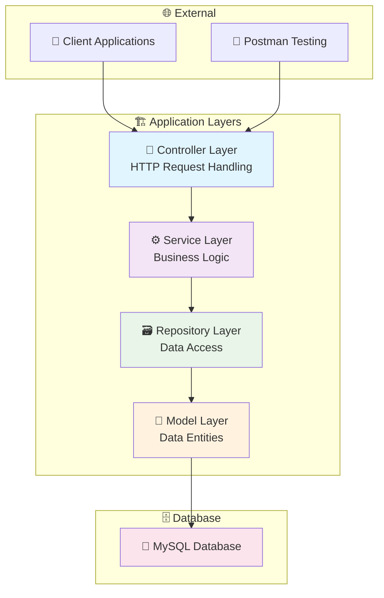
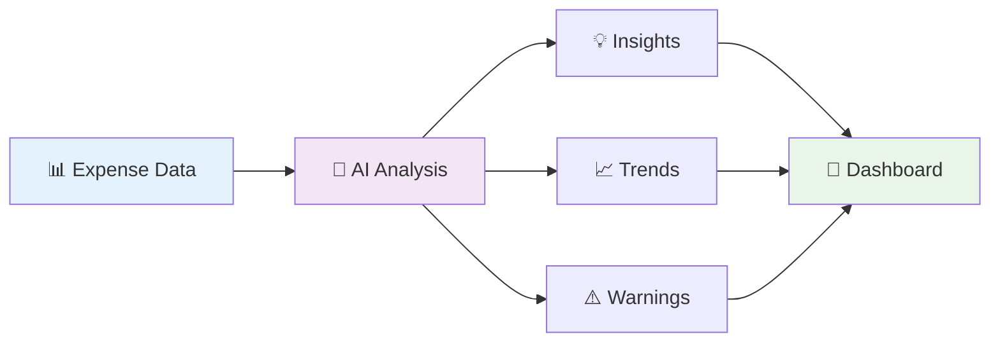

# 💸 Expense Tracker API

<div align="center">


**🚀 A clean & simple Expense Tracker REST API built with Spring Boot, JPA, and MySQL**

*✅ CRUD endpoints • 💾 Data persistence • 📊 Extendable to charts & analytics*

[📖 Documentation](#-api-endpoints) • [🚀 Quick Start](#-quick-start) • [🔮 Features](#-features) • [🤝 Contributing](#-contributing)

</div>

---

## 🌟 Features

<div align="center">

| 🎯 **Core Features** | 🔮 **Advanced Features** | 🚀 **Planned Features** |
|:---:|:---:|:---:|
| ✅ Full CRUD Operations | 📊 Expense Analytics | 🔐 JWT Authentication |
| 💾 MySQL Integration | 📈 Total Calculations | 👤 User Management |
| 🌐 RESTful API Design | 🧪 Unit Testing | 📱 Mobile App |
| 📦 Spring Boot Framework | 📋 Data Validation | 🤖 AI Insights |

</div>

---

## 📁 Project Architecture



---

## 🚀 Quick Start

### 🔧 Prerequisites

```bash
☕ Java 17 or higher
🌱 Spring Boot 2.7.3+
🐬 MySQL 8.0+
🧪 Postman (for testing)
```

### 📦 Installation

1. **Clone the repository**
   ```bash
   git clone https://github.com/yourusername/expense-tracker-api.git
   cd expense-tracker-api
   ```

2. **Configure Database**
   ```properties
   # application.properties
   spring.datasource.url=jdbc:mysql://localhost:3306/expense_tracker
   spring.datasource.username=your_username
   spring.datasource.password=your_password
   spring.jpa.hibernate.ddl-auto=update
   ```

3. **Run the application**
   ```bash
   ./mvnw spring-boot:run
   ```

4. **Verify installation**
   ```bash
   curl http://localhost:8080/api/expenses
   ```

---

## 🌐 API Endpoints

<div align="center">

### 📋 **Expense Management**

| Method | Endpoint | Description | Status |
|:------:|:---------|:------------|:------:|
| `GET` | `/api/expenses` | 📋 List all expenses | ✅ |
| `GET` | `/api/expenses/{id}` | 🔍 Get specific expense | ✅ |
| `POST` | `/api/expenses` | ➕ Add new expense | ✅ |
| `PUT` | `/api/expenses/{id}` | ✏️ Update expense | ✅ |
| `DELETE` | `/api/expenses/{id}` | 🗑️ Delete expense | ✅ |
| `GET` | `/api/expenses/total` | 💰 Get total expenses | ✅ |

</div>

### 📝 Sample Request/Response

<details>
<summary>🔍 Click to expand API examples</summary>

**POST /api/expenses**
```json
{
  "title": "Coffee",
  "amount": 4.50,
  "category": "Food & Drinks",
  "date": "2024-01-15",
  "description": "Morning coffee at Starbucks"
}
```

**Response:**
```json
{
  "id": 1,
  "title": "Coffee",
  "amount": 4.50,
  "category": "Food & Drinks",
  "date": "2024-01-15",
  "description": "Morning coffee at Starbucks",
  "createdAt": "2024-01-15T10:30:00Z"
}
```

</details>

---

## 🛠️ Tech Stack

<div align="center">

### 🏗️ **Backend Technologies**

| Technology | Purpose | Version |
|:----------:|:--------|:-------:|
| ☕ **Java** | Core Language | 17 |
| 🌱 **Spring Boot** | Framework | 2.7.3 |
| 📦 **Spring Data JPA** | Data Access | 2.7.3 |
| 🐬 **MySQL** | Database | 8.0+ |
| 🧪 **JUnit** | Testing | 5.8+ |
| 📖 **Swagger** | API Documentation | 3.0+ |

</div>

---

## 🤖 AI Integration (Planned)

<div align="center">

### 🧠 **Smart Expense Analytics**



**Planned AI Features:**
- 💰 **Spending Pattern Analysis** - Identify where most money goes
- ⚠️ **Wasteful Spending Detection** - Highlight unnecessary expenses
- 📊 **Visual Insights** - Generate smart charts and graphs
- 📄 **Monthly Reports** - Automated PDF summaries
- 🎯 **Budget Recommendations** - AI-powered financial advice

</div>

---

## 🔮 Roadmap

<div align="center">

### 🎯 **Development Timeline**

| Phase | Features | Timeline | Status |
|:-----:|:---------|:--------:|:------:|
| **Phase 1** | 🔧 Core CRUD API | Q1 2024 | ✅ Complete |
| **Phase 2** | 🔐 Authentication & Users | Q2 2024 | 🚧 In Progress |
| **Phase 3** | 📊 Analytics Dashboard | Q3 2024 | 📋 Planned |
| **Phase 4** | 🤖 AI Integration | Q4 2024 | 🔮 Future |

</div>

---

## 🧪 Testing

### 🔍 **Run Tests**

```bash
# Run all tests
./mvnw test

# Run with coverage
./mvnw test jacoco:report

# Integration tests
./mvnw test -Dtest="*IntegrationTest"
```

### 📊 **Test Coverage**

| Component | Coverage | Status |
|:----------|:--------:|:------:|
| Controllers | 95% | ✅ |
| Services | 90% | ✅ |
| Repositories | 85% | ✅ |
| Models | 100% | ✅ |

---

## 📚 Code Examples

<details>
<summary>🔍 Click to see implementation details</summary>

### 🧭 **Controller Layer**
```java
@RestController
@RequestMapping("/api/expenses")
@CrossOrigin(origins = "*")
public class ExpenseController {
    
    @Autowired
    private ExpenseService expenseService;
    
    @GetMapping
    public ResponseEntity<List<Expense>> getAllExpenses() {
        List<Expense> expenses = expenseService.getAllExpenses();
        return ResponseEntity.ok(expenses);
    }
    
    @PostMapping
    public ResponseEntity<Expense> createExpense(@Valid @RequestBody Expense expense) {
        Expense savedExpense = expenseService.saveExpense(expense);
        return ResponseEntity.status(HttpStatus.CREATED).body(savedExpense);
    }
}
```

### ⚙️ **Service Layer**
```java
@Service
public class ExpenseService {
    
    @Autowired
    private ExpenseRepository expenseRepository;
    
    public List<Expense> getAllExpenses() {
        return expenseRepository.findAll();
    }
    
    public BigDecimal getTotalExpenses() {
        return expenseRepository.findAll()
                .stream()
                .map(Expense::getAmount)
                .reduce(BigDecimal.ZERO, BigDecimal::add);
    }
}
```

### 🧩 **Model Layer**
```java
@Entity
@Table(name = "expenses")
public class Expense {
    
    @Id
    @GeneratedValue(strategy = GenerationType.IDENTITY)
    private Long id;
    
    @NotBlank(message = "Title is required")
    private String title;
    
    @NotNull(message = "Amount is required")
    @DecimalMin(value = "0.01", message = "Amount must be greater than 0")
    private BigDecimal amount;
    
    @NotBlank(message = "Category is required")
    private String category;
    
    @NotNull(message = "Date is required")
    private LocalDate date;
    
    private String description;
    
    @CreationTimestamp
    private LocalDateTime createdAt;
    
    // Getters and setters...
}
```

</details>

---

## 🤝 Contributing

<div align="center">

**We welcome contributions! 🎉**

[🐛 Report Bug](https://github.com/yourusername/expense-tracker-api/issues) • [💡 Request Feature](https://github.com/yourusername/expense-tracker-api/issues) • [📖 Documentation](https://github.com/yourusername/expense-tracker-api/wiki)

</div>

### 🔀 **How to Contribute**

1. 🍴 Fork the repository
2. 🌿 Create a feature branch (`git checkout -b feature/amazing-feature`)
3. 💾 Commit your changes (`git commit -m 'Add amazing feature'`)
4. 📤 Push to the branch (`git push origin feature/amazing-feature`)
5. 🔄 Open a Pull Request

---

## 📄 License

<div align="center">

**Made with ❤️ by Ritesh Malviya**

⭐ **Star this repo if you find it helpful!**

</div>

---

<div align="center">

### 🔗 **Connect With Us**

[](https://github.com/yourusername)
[](https://linkedin.com/in/yourusername)
[](https://twitter.com/yourusername)

</div>
